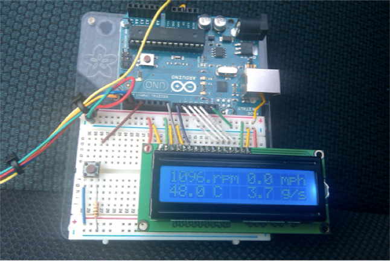

# arduino_obd
Arduino-based OBD-II (vehicle onboard diagnostic) interface written in C.

The Arduino polls information from the vehicle’s engine control unit (ECU), such as instantaneous information like RPM and vehicle speed, and also diagnostic feedback, and displays it in real time on an attached LCD screen. The Arduino can also use a data-logging shield to allow the capturing of long-term data from a vehicle in a spreadsheet-ready format (CSV).

Based on the open-source project OBDuino.

## More information

You can read more about this project on my blog: https://web.archive.org/web/20200227151527/http://rvmiller.com/2010/12/arduino-obd-ii-interface/
